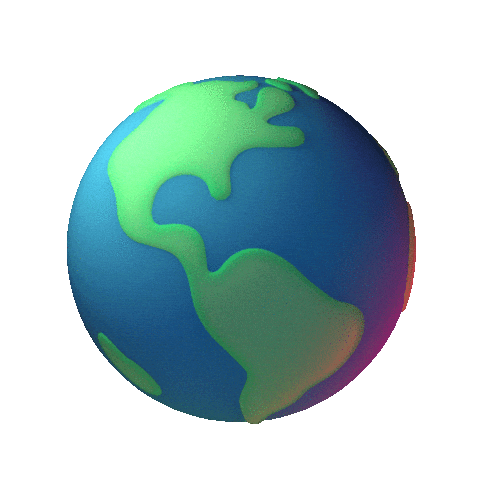
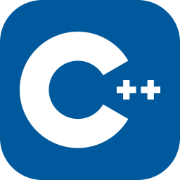

<!-- Main Heading -->
<h1 align="center">I'm Hamza Saleem</h1>

<!-- Side Image -->

<!--  -->

<!-- Typing Amination -->
<!--  -->

<!-- Stats -->

<!-- About Me -->
-  I’m a <code>Software Engineer</code> and <code>Freelancer</code>
-  Ask me about <code>Software Engineering</code>
-  Fun fact: You can call me <code>Mr Bugz</code>
-  Reach me out at <a href="mailto:hamxasaleem310@gmail.com">hamxasaleem310@gmail.com</a>

<!-- Social Links -->
##  Contact with me

<!-- Tech Stack -->
##  Languages and Tools

 

<!-- Snake Animation -->
 

  

<!-- Github Trophy -->
##  GitHub Trophy

<!-- Github Stats -->
##  Github Stats

